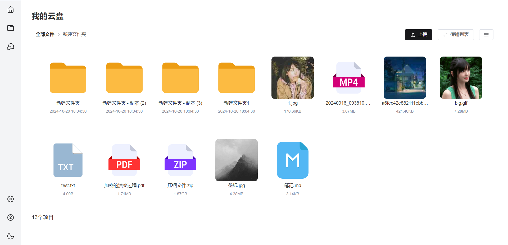
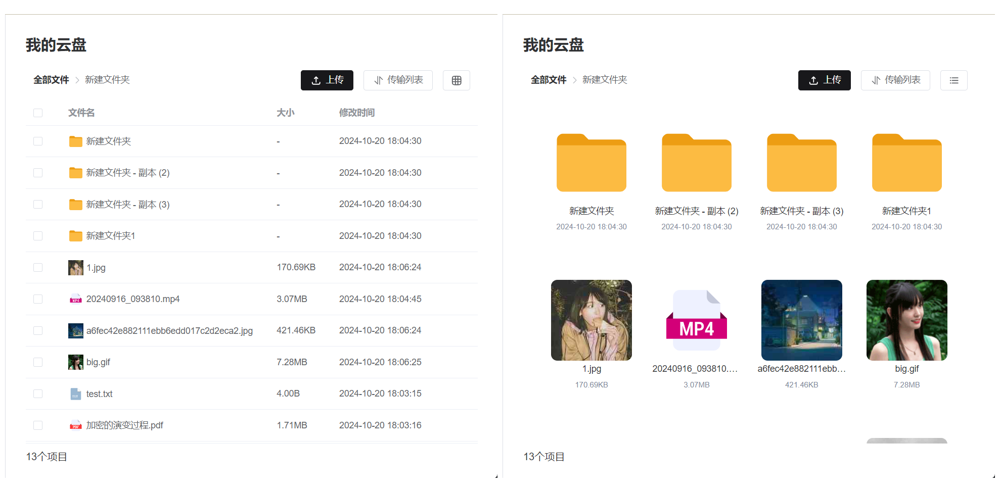
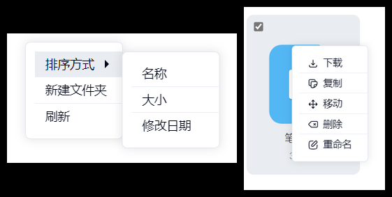
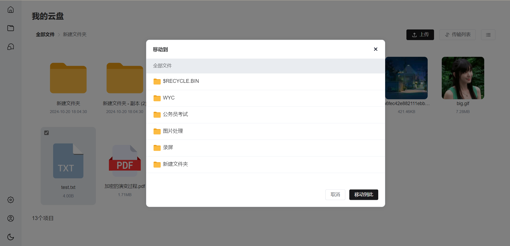
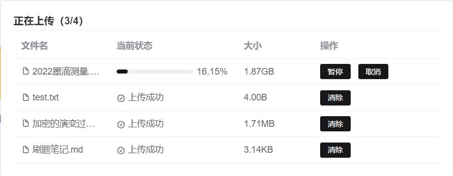
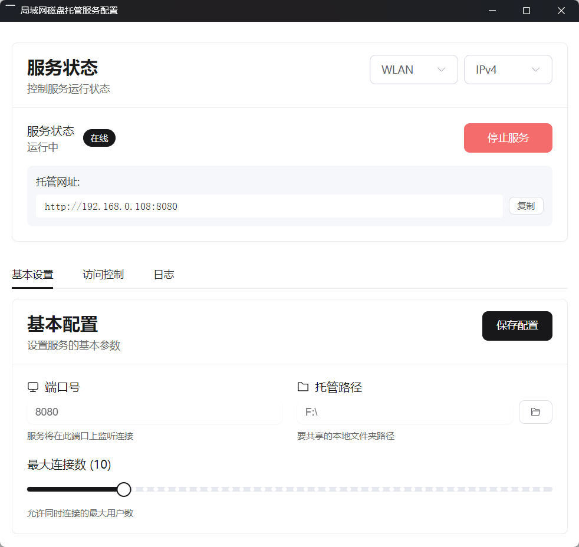

# 🛜📁 局域网文件夹托管

## 一、项目介绍

通过浏览器页面来共享本地文件夹，对其进行网盘式的在线管理。

支持**列表**与**网格**两种查看模式

☑️ 支持的操作：

- 支持暗黑模式
- 按照名称、文件大小、修改日期排序
- 新建文件夹
- 刷新
- 文件的下载、复制、移动、删除与重命名
- 针对大量文件渲染场景的虚拟列表
- 文件与文件夹的上传，支持大文件分片、断点续传，上传的暂停与取消
- 提供图片、txt、pdf、markdown 及音视频等多种格式的在线文件预览
- ……

## 二、技术栈

前端：Vue3 + TS + Element-plus

后端：koa2

## 三、项目运行 🚀

### 1. 源代码运行 ⛏️

> 运行前请先安装`nodejs`

`clone`项目到本地

```shell
git clone https://github.com/dcbestwords/Local-cloudPan.git
```

前端运行

```shell
cd admin
npm i
npm run dev
```

后端运行

> 可以通过`server/config.js`配置后台服务的端口及代理的文件夹

```shell
cd server
npm i
npm start
```

为了确保运行正确，请先运行后端服务。再运行前端，之后访问 http://localhost:8888

### 2. 桌面端程序运行 🖥️

1. 通过本页面[releases](https://github.com/dcbestwords/Local-cloudPan/releases)选项卡下载桌面端程序安装运行。
2. 设置服务配置和参数，保存配置，开启服务。
3. 复制托管网址，在浏览器中打开进行管理。

## 四、UI 演示

### 主界面



### 两种查看模式



### 右键菜单



### 复制与移动界面



### 传输列表



### 桌面端启动器


